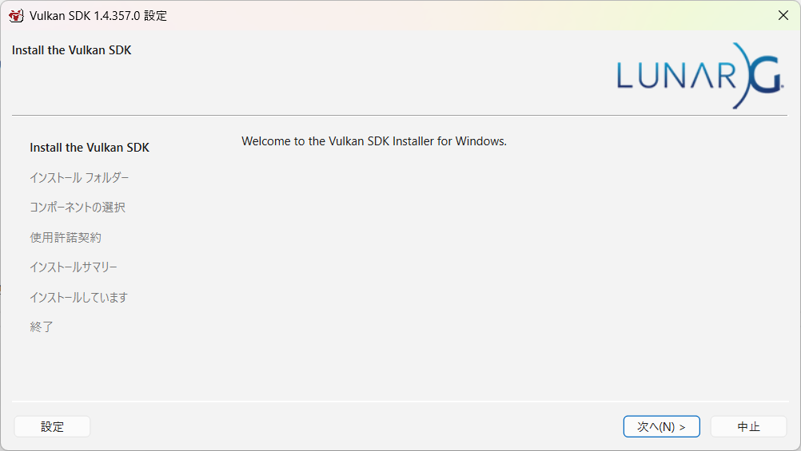
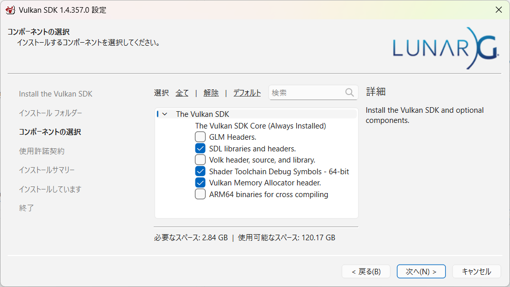

[Vulkan Guide](https://vkguide.dev/) を参考にRustで作りながら勉強するリポジトリ

# 0

## Rustのインストール

### Visual Studioの MSVC C++ビルドツール

Visual Studioを導入済みなのでスキップ

### rustのインストール

https://learn.microsoft.com/ja-jp/windows/dev-environment/rust/setup?tabs=winget

```
winget install Rustlang.Rustup
```

新しいターミナルで確認

```
cargo --version
cargo 1.98.0 (797e8a9bc 2026-08-05)
rustc --version
rustc 1.98.0 (88d9e12ae 2026-08-18)
```

### vscode環境の準備

1. vscodeをインストール
2. rust-analyzer 拡張機能をインストール

### Hello, worldする

```
cargo init
cargo run
Hello, world!
```

## Vulkanのインストール

LunarG Vulkan SDKをインストール

https://www.lunarg.com/products/vulkan-sdk/

vulkansdk-windows-X64-1.4.357.0.exe

**管理者として実行**





## ashのインストール

```
cargo add ash
```

```rust
use ash::vk;

fn main() {
    println!("Vulkan version: {:?}", vk::make_api_version(0, 1, 3, 0));
}
```

## ImGui

```rust
cargo add imgui
```

```rust
use imgui::{Context, dear_imgui_version};

fn main() {
    imgui_test();
}

fn imgui_test() {
    let mut imgui = Context::create();

    imgui.set_ini_filename(None);

    println!("Dear ImGui version: {}", dear_imgui_version());
}
```

## glam

https://docs.rs/glam/latest/glam/

```rust
cargo add glam
```

```rust
use imgui::{Context, dear_imgui_version};

fn main() {
    glam_test();
}

fn glam_test() {
    let v = Vec3::new(1.0, 2.0, 3.0);
    println!("glam is installed: {:?}", v);
}
```

## SDL

```
cargo add sdl2
```

このままビルドすると MSVC のリンカが落ちる

```
LINK : fatal error LNK1181: 入力ファイル 'SDL2.lib' を開けません。
```

`sdl2` クレートは既定でシステムにインストール済みの SDL2 を探しに行くため。
`bundled` featureを使うと `sdl2-sys` に同梱されている SDL2 のソースをその場でビルドしてくれる。
さらに `static-link` を付けると実行ファイルに静的リンクされるので `SDL2.dll` の配布も不要になる。

CMakeが必要なのでインストール

```
winget install Kitware.CMake
```

Cargo.toml

```toml
sdl2 = { version = "0.38.0", features = ["bundled", "static-link"] }
```

ただし同梱されている SDL2 の `CMakeLists.txt` が `cmake_minimum_required(VERSION 3.0.0)` を宣言していて、
CMake 4.x は 3.5 未満との互換を削除しているのでこのままだとconfigureで失敗する。
`.cargo/config.toml` で互換ポリシーの下限を指定して回避する。

```toml
[env]
CMAKE_POLICY_VERSION_MINIMUM = "3.5"
```

これで `cargo run` が通る（初回は SDL2 のビルドで少し時間がかかる）


# 1

## 0段階のコードを模倣

SDLでウィンドウを表示するまで

C++からRustに変更したことでAPIが変化しているので調べながら対応するAPI置き換える

initとcleanupはRustにしたことで消滅

### API対応表

| vkguide (C++)                             | Rust (rust-sdl2)                                   |
| ----------------------------------------- | -------------------------------------------------- |
| `SDL_Init(SDL_INIT_VIDEO)`                | `sdl2::init()` + `sdl_context.video()`             |
| `SDL_WINDOW_VULKAN`                       | `.vulkan()`                                        |
| `SDL_CreateWindow(...)`                   | `video_subsystem.window(...).build()`              |
| `SDL_WINDOWPOS_UNDEFINED`                 | `.position_centered()`（変更）                     |
| `while (SDL_PollEvent(&e) != 0)`          | `while let Some(event) = event_pump.poll_event()`  |
| `e.type == SDL_QUIT`                      | `Event::Quit { .. }`                               |
| `e.type == SDL_WINDOWEVENT`               | `Event::Window { win_event, .. }`                  |
| `SDL_WINDOWEVENT_MINIMIZED` / `_RESTORED` | `WindowEvent::Minimized` / `WindowEvent::Restored` |
| `std::this_thread::sleep_for(100ms)`      | `std::thread::sleep(Duration::from_millis(100))`   |
| `SDL_DestroyWindow` / `SDL_Quit`          | Dropにまかせる（明示的な呼び出しなし）             |

### 省略したもの

- `_isInitialized` フラグ
  - Rustでは `new()` が返ってきた時点で全フィールドが初期化済みなことが型で保証されるので、初期化済みかどうかを実行時に持つ意味がない
- `loadedEngine` グローバル変数と `VulkanEngine::Get()`
  - どこからでもエンジンを触るためのC++側の仕掛け。Rustだと借用チェッカと相性が悪いうえ、`&mut VulkanEngine` を引数で渡せば済む
- `SDL_DestroyWindow` の呼び出し
  - `Window` → `VideoSubsystem` → `Sdl` と参照を保持していて、`Sdl` の Drop が参照カウントで `SDL_Quit` を呼ぶ。
    先に `SDL_Quit` されてウィンドウが宙に浮く、みたいなことは起きない